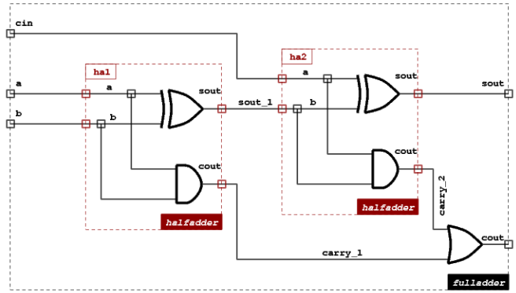

# ObjectModelisation
Comprehensive C++ OOP project

Doing this project again because it covers the most essential notions of C++ so it's good exercising.

The aim of this project is to display logic gates using Qt6.

Notions covered: 
- friend classes
- data structures : vectors, maps, lists
- netlists
- cast, static_cast
- overload
- forward declarations, #pragma_once
- xml parser
- pointers and references

<<<<<<< HEAD
### TME45
In TME 45 most functions are implemented (except remove() and DTOR that I'll lasave for the end and all functions related to the object position because it's not used yet).

In the main *or*, *and*, *xor* and *halfadder* have been created, as well as a *fulladder* one.
Cells can display their structure using its toXml() function.

Here is the fulladder we want, let's dive in a little.

1. Instanciate the cell and name it : fulladder
2. Instanciate all its terms, a term is a terminal: the gate's port. Each term has a name and a direction, it's either an input (Term::In) or an output (Term::Out). 
3. Create the Nets. Right now the terminals aren't connected to anything, they're just part of the cell fulladder, nets are like wires. So we need *External* wires, for our inputs and outputs and *Internal* ones, to connect our components together.
For instance, we need external nets for our *a*, *b* and *cin* inputs. And we also need internal nets to connect the first halfadder output to the second halfadder input. On the schema that net is represented by sout_1.
4. Once we created all of our nets, which haven't done the connection betwwen our components yet, we need to instanciate the cells we need. So we need two halfadders and an *or* gates that will take both carries and return cout.
5. Now it's time to connect our cells to our terminals using the nets. 
Before getting to the part that might be confusing, let's start easy and connect the most obvious nets which are the terms to the main cell (the fulladder).
Once that's done, we can connect the internal nets with the instanciated cells, like halfadder1's cout output to halfadder2's b input using the sout_1 net.

And we're done. 
=======
**update 29/06**
- implemented most functions
 - TODO : DTOR and remove() functions
- implemented xml format print

- **coming up** : xml parser to load files  
>>>>>>> c104be90e027d7527276e6a19b8ef7837fa1dd81
